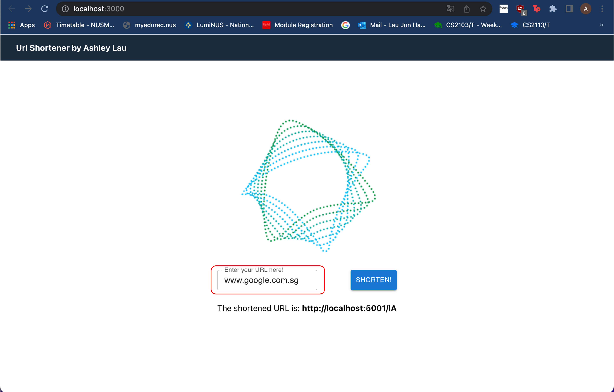

# TAP Assignment for GDS Team
**Prerequisites for system**
* Node

## Frontend setup

* Go to the gds-frontend
* Run `npm install` to set up the node dependencies
* Run `npm start` to spin up local frontend at `http://localhost:3000/`

## Backend setup

* Go to the gds-backend
* Run `npm install` to set up the node dependencies
* Run `npm start` to spin up local frontend at `http://localhost:5001/`
* Run `npm test` to run the test suite

## Instructions to try the application
* Simply type in the original url in the textfield in the red rectangle and press the `shorten` button! 
 

